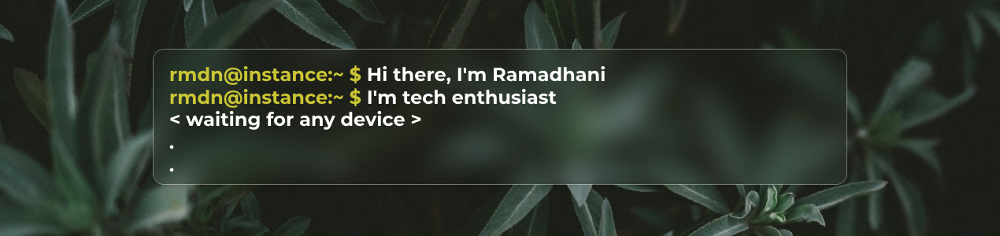

<!--
-->

   

<!--  -->
- 🔭 I currently work as a Purchasing Specialist.
- 🌱 I'm a Graphic Designer who is interested in the world of programming.
- 🤔 I'm looking for help regarding learning about Android Development.
- 💬 Ask me anything. I'm happy to help.
- 📫 How to contact me: ramadhanifals@gmail.com
- ⚡ Fun fact: I'm the red Power Rangers hahaha.

### 📱 My Devices

#### Phones / Pad

